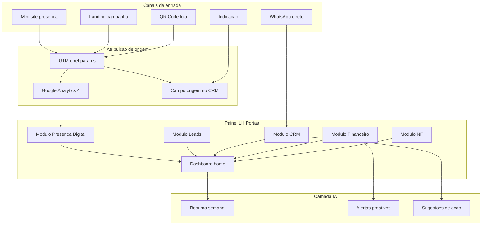

# Arquitetura — Painel unificado do cliente + IA

**Cliente:** LH Portas · **Uso:** interno — visão do produto final e roteiro técnico

---

## Visão geral

Um **único login** para o cliente acessar tudo que foi contratado: presença digital, leads, CRM, financeiro e NF. Você (desenvolvedor) mantém hospedagem, evolução e suporte — base da **recorrência mensal** e da **dependência saudável**.

---

## Dashboard home (o que o cliente vê)

| Widget | Fonte | Fase |
|--------|-------|------|
| Acessos ao mini site (7/30 dias) | GA4 API | 1 |
| Cliques por botão (WhatsApp, Maps…) | GA4 eventos | 1 |
| Origem dos acessos (QR, Instagram, direto) | UTM + GA4 | 1 |
| Leads da landing | Formulário / DB | 2 |
| Clientes sem contato há X dias | CRM | 4 |
| Fluxo de caixa do mês | Financeiro | 3 |
| Notas emitidas / pendentes | NF | 5 |
| Alertas IA | Camada IA | 3+ |

**Pergunta que o painel responde:** *"De onde veio este cliente e o que fazer agora?"*

---

## Atribuição de origem (implementação)

| Canal | Como rastrear |
|-------|---------------|
| QR na loja | `?ref=qr-loja` ou UTM `utm_source=loja` |
| Instagram bio | `utm_source=instagram` |
| Google Ads | `utm_source=google&utm_medium=cpc` |
| Indicação | Campo manual no CRM + tag `indicacao` |
| WhatsApp direto | Pergunta "como nos conheceu?" no primeiro contato |

Todos convergem no CRM (Fase 4) com campo **origem** obrigatório.

---

## Roadmap de implementação do painel

| Fase | Entrega painel | Stack sugerida |
|------|----------------|----------------|
| 1 | Embed GA4 ou API simples + página "Presença digital" | Estático + GA4 |
| 2 | Tabela de leads da landing | Supabase + painel mínimo |
| 3 | Módulo financeiro no mesmo login | Supabase Auth + React/Next |
| 4 | CRM integrado, origem do lead visível | Mesmo backend |
| 5 | NF + alertas certificado | API emissor + jobs |
| 6 | IA: resumo semanal por e-mail/WhatsApp | Regras → depois OpenAI/Claude API |

**Não construir painel completo na Fase 1** — só planejar URLs e dados que o mini site já gera (GA4, UTM).

---

## Camada IA (evolução gradual)

### Fase A — Regras (sem API paga)

- E-mail semanal: "X acessos, botão mais clicado: WhatsApp"
- Alerta CRM: "N clientes sem contato há 60 dias"
- Alerta financeiro: "Despesa material 20% acima da média"

### Fase B — IA generativa (CRM + financeiro)

- Resumo de notas no prontuário do cliente
- Sugestão de texto de follow-up pós-instalação
- Categorização automática de lançamento financeiro
- Pré-preenchimento de descrição de serviço na NF (revisão humana obrigatória)

**Custo IA:** repassar ou incluir na mensalidade (ex.: +R$ 50–100/mês com limite de tokens).

---

## Modelo comercial do ecossistema (referência interna)

| Modelo | Valor |
|--------|------:|
| Soma avulsa (5 módulos) | R$ 37.000 – R$ 52.500 |
| Pacote mensal sugerido (12 meses, dev progressivo) | R$ 997/mês + implantação por fase |
| Fase 1 fechada agora | R$ 2.000 + R$ 150/mês manutenção mini site |

---

## O que você controla (dependência saudável)

- Hospedagem e domínio configurados por você
- Dados no seu stack (Supabase/projeto seu)
- Analytics e painel sob seu login de admin
- Evolução faseada = cliente não "compra e some"

**Migração:** após quitação de contrato ou taxa de handover — definir em contrato escrito.

---

## Replicável para outros clientes

Duplicar `interno/` + ajustar: nome, dores, ordem das fases, valores. O **painel unificado + IA** é o produto premium que diferencia de "fazer um site". Template de módulos permanece igual.
